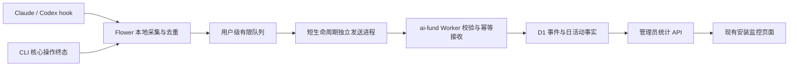

# 遥测第一批技术设计

日期：2026-09-06。范围依据：[prd.md](prd.md)。本文记录已实施契约；本地验证与发布边界见 [check-report.md](check-report.md)。

## Architecture And Ownership

- `flower-trellis`：事件、身份与开关、本地队列、静默发送、原生平台注册和命令终态。
- `ai-fund/worker`：v2 协议、限流、D1 迁移、幂等接收、聚合、清理与现有设备删除一致性。
- `ai-fund/frontend`：使用概览、平台与版本、持续使用、操作质量四个区域，复用现有安装监控与管理员登录体系。
- Flower 自有 hook 在 `src/assets/` 编写，经 `flower-assets.js`、builtin `content-adapter.js` 和 `src/patches/platforms/` 声明投影及注册；不修改项目已部署目录充当发布源。此方案不要求改 Skill-Garden 子仓源码。

## Platform Coverage

| 入口 | 观测能力 | 约束 |
| --- | --- | --- |
| Claude Code / Codex，0.6 full 集成 | SessionStart、UserPromptSubmit 日活动 | 新独立静默 handler；不挂在三份上下文分段内 |
| old/0.5、其他 AI 平台、未安装 hook | 新 CLI 的核心操作结果 | 不推断 AI 平台、不显示该平台使用量为零 |
| CLI 初始化、项目升级、自更新、插件安装 | 可观测终态，同时贡献 CLI 日活动 | 只统计真实外部操作，help/预览/菜单/无操作退出排除 |

注册命令显式传 `claude` / `codex`，平台字段不来自目录扫描、模型回答或环境变量碰巧存在。SessionStart 可覆盖 startup/resume/clear/compact，仅触发日去重；不改变原生上下文 handler 的 matcher。UserPromptSubmit 用于长会话跨日后有新输入的活动。

hook 只读取定位目标所需字段和固定事件类型；prompt、对话、session ID 不进入采集器。尊重 `TRELLIS_HOOKS=0` / `TRELLIS_DISABLE_HOOKS=1`，Codex 非交互禁用语义按既有规则处理。未知事件静默跳过。

Python 资产只做输入适配、本地去重提示读取与调用 Node 采集命令；身份创建、开关判断、日期最终判断和队列写入仅由 Node 负责。若快速跳过需要定位用户目录，其 XDG/Windows APPDATA/默认路径算法必须与 `flowerConfigDirectory()` 以共享 fixture 验证一致；提示错误或缺失交回 Node 判断。

## Events And Fields

v1 原入口 `POST /api/flower-trellis/telemetry` 继续接受原 schema 和 4 KiB 请求。

新增 `POST /api/flower-trellis/telemetry/events`：每次只提交一个安装实例，envelope 为 `schema_version=2`、`device_id`、`events[]`。每批 1–20 条，流式请求体最大 64 KiB，每条规范化事件最大 4 KiB。公开写入口复用全局与设备限流绑定，配置缺失保持关闭写入。

| 字段 | 约束和语义 |
| --- | --- |
| `event_id` | 随机 UUID，首次入队后固定；同设备内唯一 |
| `event` | `activity_daily` 或 `operation_completed` |
| `observed_at` | UTC ISO 时间；活动观测时间或操作取得终态时间 |
| `source_kind` | `ai_hook` 或 `cli` |
| `ai_platform` | AI 活动为 `claude/codex`，CLI 为 null；严格校验事件/来源组合 |
| `platform` / `arch` | 沿用操作系统/架构语义与长度规则 |
| `flower_version` | 当前执行代码启动时的 CLI 版本，必填；自更新不得用完成后新包版本冒充执行器版本 |
| `bundled_trellis_version` | 运行时捆绑 Trellis 版本，未知 null |
| `project_trellis_version` | 目标项目 `.trellis/.version`，未知 null |
| `installed_skill_garden_version` | 目标 lock 的 builtin 版本，缺失 null；这是随安装时 Flower 发布的强化包版本 |
| `developer_name` | 沿用既有解析顺序，可空；名称缺失不阻断 v2 |
| `operation` | 终态专属：`init/update/self_update/plugin_add` |
| `outcome` | 终态专属：`success/failure/cancelled` |
| `error_category` | 失败专属：`precondition/network/permission/conflict/upstream/io/unknown`，其余 null |
| `failure_stage` | 有限阶段：`prepare/resolve/authorize/upstream/apply/recover/unknown`，其余 null |
| `duration_ms` / `duration_kind` | 终态专属：非负整数或 null；`execution/elapsed/unavailable` |

白名单拒绝未知字段和非法组合；不上传路径、参数、外部 Plugin ID、原始错误或堆栈。状态事件不夹带操作字段。版本复用既有格式边界；错误码经受控映射后上传分类，未知错误不从 message 正则推断。

`received_at`、时间有效性与统计日由服务端产生。容许 `observed_at` 落在接收时刻前 72 小时至后 5 分钟；未来容差内的值以接收时刻封顶，防止提前产生未来活动。超界返回该事件的终止拒绝 `invalid_time`，不归到收件日活跃；本地诊断可见拒绝分类。UTC 日期按校验后时间派生。

响应为逐事件结果：`accepted/duplicate/rejected` 加固定拒绝原因；不回显载荷。格式非法的 envelope 返回 400，超限返回 413，限流 429，暂时不可用 503。已接受/相同载荷重复可清队列；同 ID 不同 canonical payload 返回 `event_conflict`，不得覆盖。暂时失败保留未确认事件。批次允许已提交部分得到确认，其余重试。

## Local State And Sending

- 继续使用 `<flowerConfigDirectory>/telemetry.json` 作为唯一开关/设备 ID，保持 schemaVersion=1 与既有字段兼容；v2 队列、去重提示和重试诊断单独放用户级 `telemetry-v2/`。
- 新版所有状态写入路径共享互斥：锁内重读、首次创建 UUID、合并本次字段、原子替换；v1 网络完成后也需重读再合并，避免复写旧开关/时间。网络阶段不持状态锁。
- 文件采用受限权限、普通文件与软链接检查、同目录原子替换。锁失败或状态损坏时遥测静默降级；后台不重建损坏身份。
- 日活动语义键为安装 ID + UTC 日期 + AI 平台。仅事件可靠入队后写去重提示；并发重新校验语义键，hint 损坏不可产生新设备 ID。
- 每个事件独立不可变文件，队列最多 200 条、单条 4 KiB、保留 72 小时。优先删除过期项，满载丢弃最旧待发送项并仅累计本地丢弃数。日提示随事件过期/淘汰清理或失效，不能永久压制尚未回收的活动。
- 入队成功后按需启动独立 sender，`stdio` 与主进程脱离，限制只有一个有效 sender 租约。单请求 10 秒，单次进程最多发送一批并在 15 秒内退出；忙碌时由后续受观测活动再次唤起，不建立常驻进程。
- 重试最短 1 分钟，指数退避到 1 小时，加抖动并尊重合法 `Retry-After`；后续机会到来且到期才重试。完全不再运行时可能留下未补传事件，显示统计是已回收样本。
- 同日快速跳过不能永久饿死待发送队列：hook 在同日有 pending 且重试到期时仍允许唤起 sender，频率由全局重试元数据限制；Python hint 无权改状态。
- sender 从入队事件读取已裁剪的版本快照，不重新读取项目路径或当前配置来重写历史事件。
- `FLOWER_NO_TELEMETRY` 非空时记录/发送入口立即退出且零写入。持久 disable 在锁内关开关、清 pending 与 hint；发送前再检查开关。已经发出的请求不能保证撤回，disable 后不启动新请求；响应处理不能复活已清队列或覆盖禁用。
- 旧版已运行进程不具备新锁协议，无法承诺跨所有历史二进制的并发强一致；新版本之间必须通过并发测试，旧格式/旧客户端接收必须保持兼容。
- `telemetry status` 只读增加 pending 数、最近 v2 成功/失败分类与最早可重试时间，不主动联网。无状态时继续不创建身份。

## Operation Boundaries

新增小型内部操作上下文，显式传递给嵌套调用：随机事件 ID、外部操作类型、是否开始执行、执行器版本快照、计时状态与最终写入标志。该内部契约由 `telemetry-operation.js` 维护，内部调用显式复用同一上下文。

| 外部操作 | 开始/结束边界 | 嵌套和特殊情况 |
| --- | --- | --- |
| init | 选项/确认结束后进入实际准备，初始化和强化均结束或失败 | 内部 plugin add 不单独计数；升级提示导致提前退出不造 init 成功 |
| update | 排除 dry-run 后进入实际更新，补偿后取得终态 | 失败回退成功仍为原操作 failure；回退失败记录 recover 阶段 |
| self-update | 排除 dry-run/无确认/no-op 后开始安装或项目更新 | 子进程 update 传仅用于抑制重复采集的内部上下文；顶层 self_update 写一次；不把旧进程加载的版本写成新版本 |
| plugin add | 命令或管理器选定一次安装后进入准备/解析，完整动作结束 | 物化递归、批准预览、执行重试共用 ID；外层菜单不计操作 |

有结构化错误码的 Plugin 在 catch 转换退出码前记录分类；外层继续沿用返回码和原输出。纯上游进程只有退出码时标 upstream/unknown，不抓取或上传 stderr。参数语法失败、帮助、预览和未取得执行意图的前置退出不进入操作成功率；已开始的实际准备/解析失败可为 precondition。

计时使用单调时钟。具备完整交互暂停边界的执行用 `execution`；上游 PTY 等无法分离交互等待的路径用 `elapsed`。人工交互不可见时不伪称纯执行，UI 按 duration_kind 分组展示 P50/P95。没有可靠计时则 null/unavailable。终态入队不包括遥测等待与操作完成后的下一步菜单。

可捕获取消尽力记录 `cancelled`；不得为遥测改变 SIGINT 立即退出语义。强杀、断电或状态写入失败可能没有终态，成功率只表示收到的 success/failure 样本。

## Server Facts And Compatibility

新表由独立可重放的迁移文件创建，并同步 `worker/schema.sql`：

| 表 | 主键 / 用途 |
| --- | --- |
| `flower_telemetry_events` | `(device_id,event_id)`；保存经裁剪事件、canonical hash、接收时间、有效日期及幂等接收 token，保留 180 天 |
| `flower_activity_daily` | `(device_id,activity_date,activity_source)`，source=claude/codex/cli；保存当日首/末有效观测与对应版本快照，保留 180 天 |
| `flower_telemetry_observations` | `device_id`；保存首次 v2 有效活动日期、首次 v2 接收时间与最新 v2 快照，随设备生命周期保留 |

新事实关联现有 `flower_devices`。首次 v2 可使用必填 CLI/OS 字段插入设备基线；现有设备不因迟到事件回退当前态。旧 overview/list 继续表达原安装上报口径，新 analytics 版本口径只用 v2 快照，不能混用 v1 last_seen_at。

每个新事件采用一个原子接收事务：设备基线保证存在 → insert-on-conflict event → 仅新插入才维护 daily/observation → 有效新快照更新。一个请求内的唯一接收 token 配合唯一键控制副作用；不能“先 SELECT 再无条件 INSERT/累计”。重复同 ID/同 hash 只回执。操作事件同时贡献其终态日 CLI 活动，日活动源不由 HTTP 次数累计。

observation 的首次日期取所有有效活动最小值，最后快照按有效观测时间单调前进；同时间不同事件用固定事件 ID 排序打破平局。迟到补传可修正近期队列起点，成熟窗涵盖 72 小时补传容忍。设备平台和版本可有多次观测，不能将最后观测的项目版本解读为完整项目清单。

设备删除在同一事务中删除新事件、日活动与锚点，再执行既有历史/别名/设备删除，保持外键一致。后续真实重报可重新出现，沿用当前删除语义。重放已清理的超期事件因时间窗被拒绝，不会在事件表清理后重新增加历史指标。

每日利用 Worker 已有 scheduled 路径独立调度有界清理，按索引分块删除超过 180 天的 events/daily，保留 observation；异常与其他 scheduled 作业隔离。数据库行为用真实 SQLite/D1 fixture 验证，不只用 JS 内存 SQL 替身证明原子性。

## Metrics And Admin API

新增管理员查询 `GET /api/flower-trellis/admin/analytics`，复用 `requireAdminResponse`：未登录 401、无管理员角色 403。前端显隐不是鉴权边界。

参数：`from/to` 为 UTC 日期、范围最多 180 天，默认近 30 天；`ai_platform`、`operation`、`flower_version`、`platform` 均校验白名单/格式。通用日期作用于所有区域；AI 平台筛选只作用平台/活动区域，操作筛选只作用质量区域，响应 `applied_filters` 明确实际口径，禁止把全部 CLI 操作归到某个 AI 平台。

响应固定分区：`coverage`（开始采集时间、已支持入口、时间口径、补传宽限）、`summary`、`daily[]`、`platforms[]`、`versions[]`、`cohorts[]`、`operations[]`、`applied_filters`。分组有日期和枚举上限；版本分布只用 v2 对应范围内的有效快照，过滤要先选快照再分组，避免一个设备因重复发送计入同维度多个版本。

- DAU 为当日有效活动去重 device_id；近 7/30 日使用截止日及前 6/29 个 UTC 日。
- 平台活跃分别去重，同一设备跨平台可重复归属，总体仍按 device_id 去重。
- 新增观测采用 first v2 activity 日期，不声称首次安装；旧 v1 历史不回填。
- 回访为首次日期后第 1–7/1–30 天任一天再次有效活动；队列窗口结束加 72 小时后成熟，未成熟/零分母输出 null 和明确状态，不输出假 0%。
- 成功率 success/(success+failure)，返回原始分子分母；取消单列。耗时按操作/outcome/duration_kind 分组，样本为零的分位数为 null。
- 日期越界事件从分析排除并由客户端 status 显示 invalid_time；面板说明时钟异常和未补传均可能造成观测缺口，不能恢复为真实使用总量。

前端以 `TrellisUsageAnalytics.vue` 承载四个分析区域，嵌入现有 `TrellisTelemetryPanel.vue`，复用 Vue/ECharts 和现有 API 封装。显示 UTC、样本量、观察中与覆盖说明；数据质量口径不以 tooltip 隐藏到无法理解指标。

## Defaults And Tradeoffs

- UTC 日界避免多时区重复口径；180 天事实覆盖当前 7/30 日回访与近半年趋势，暂不做长期聚合仓库。
- 同日每平台只采首次活动可降低输入 hook 成本，也意味着当日仅靠活动事件不能反映随后切换的项目版本；操作事件可补充对应操作版本，页面用“最近观测”表述。
- 有限队列、有限发送进程保证降级边界，不能承诺断电、强杀、永久离线或关闭遥测的使用被完整记录。
- v1 endpoint 和新 endpoint 分开升级；新版 v1 兼容快照的网络发送也归入独立 sender，原 self-check 的 JSON、版本检查 cache 和 registry 行为保持其现有职责。

## Rollout And Rollback

先合入/准备 ai-fund schema 与向后兼容的接收服务，再准备 Flower 客户端与管理端。实施批准覆盖两仓本地修改、迁移文件和隔离验证，生产执行另按各仓 SOP。

发布前依次检查新表就绪、Worker 接收/鉴权/限流、客户端与 hook、管理端。回退优先停止 v2 采集或接收，保留 v1 与新表证据；不得通过删旧表、重建设备 ID 或直接改 dogfood hook 回退。
